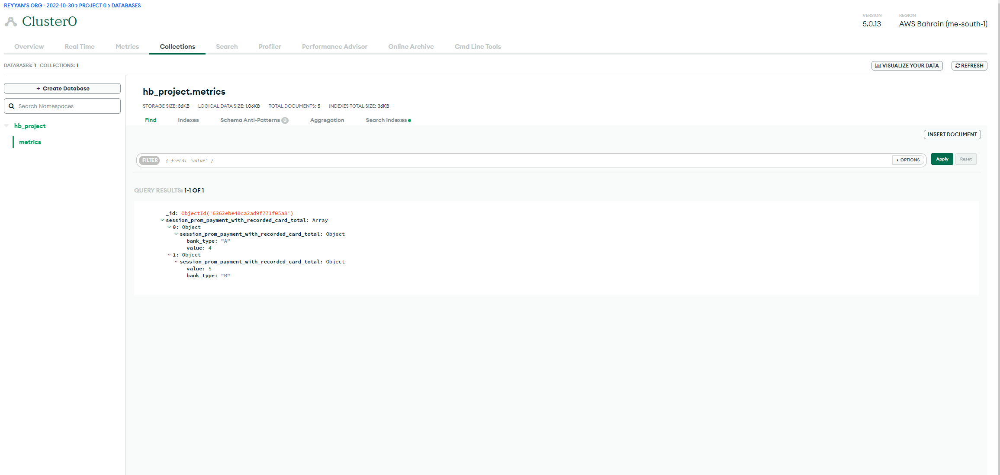
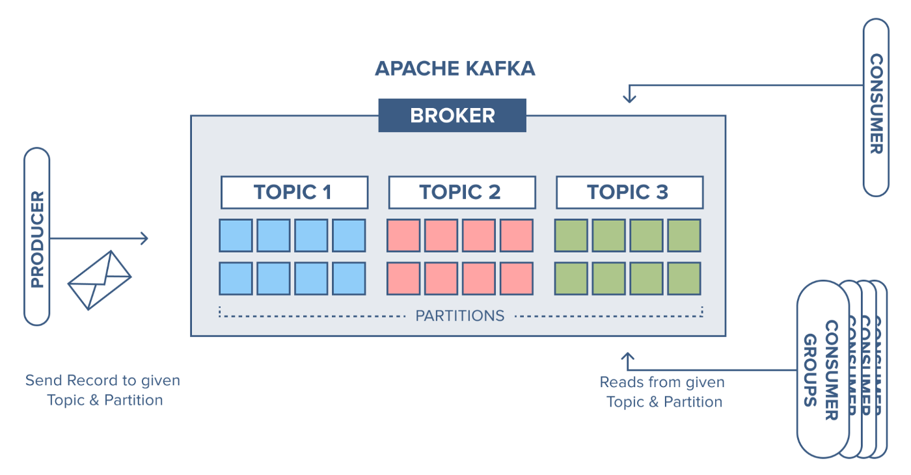

# PrometheusMetric_to_MongoDB
Exporting Prometheus Metrics to MongoDB

###Tools and Technologies:
- Prometheus
- Kafka
- MongoDB

###References:
- https://stackoverflow.com/questions/65388098/how-to-parse-prometheus-data
- https://pkg.go.dev/github.com/prometheus/common
- https://prometheus.io/docs/instrumenting/exposition_formats/
- https://www.youtube.com/watch?v=O69sz842sFs
- https://betterprogramming.pub/how-to-use-golang-structs-with-mongodb-f1772e4a1da3

>MongoDB Outputs
> 

> Apache Kafka Architecture Diagram
> 